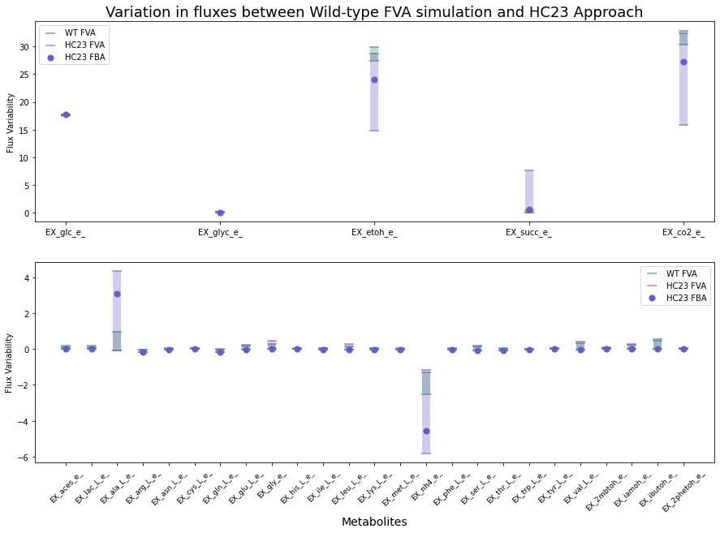
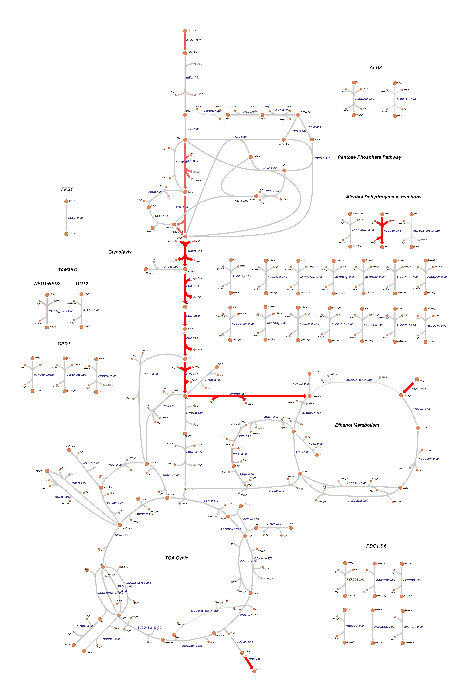
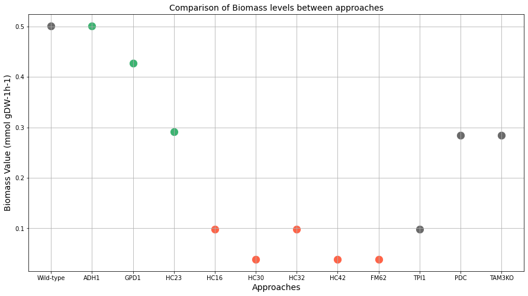
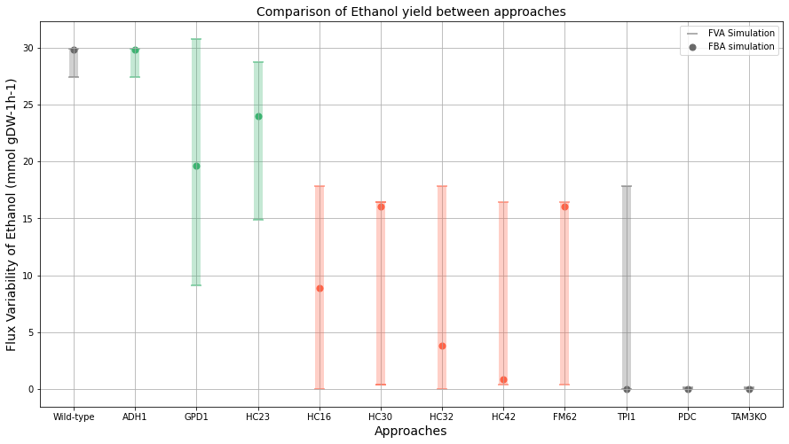

# Metabolic-Constraint-based-Reconstruction-Analysis-and-Visualization
This work represents one of the components of my master thesis project: "Analysis of metabolic pathways of Saccharomyces cerevisiae in alcoholic fermentation to mitigate glucose rise in grapes due to global warming effects".

Using Python packages and libraries such as: 
* COBRApy
* Escher Python
* Pandas
* Numpy
* Matplotlib

We were able to perform Constraint-based modelling techniques such as Flux Balance Analysis and Flux Variability Analysis in the target metabolic model. Aditionaly we were capable of plotting the results in different ways, and provided a visual output for our metabolic simulations.

# Results
The final results can be seen below: 
* Variation in fluxes between Wildtype simulation and HC23 simulation.

* Pathway layout obtained from the Flux Balance Analysis performed on the Wildtype simulation.

* Comparison of Biomass yield between the different approaches.

* Comparison of Ethanol yield between the different approaches.

